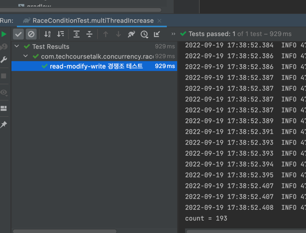
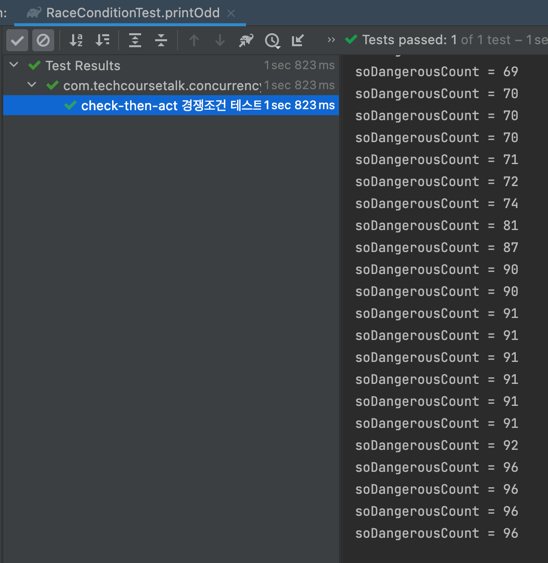

# 레이스 컨디션

예제 컨트롤러
```java
@RestController
@RequestMapping("/race-condition")
public class RaceConditionController {

    public static Integer soDangerousCount = 0;

    @PostMapping("/1/increase")
    public ResponseEntity<Void> increaseCount() {
        soDangerousCount++;
        return ResponseEntity.ok().build();
    }

    @GetMapping("/1/count")
    public ResponseEntity<Integer> getCount() {
        return ResponseEntity.ok(soDangerousCount);
    }

    @PostMapping("/2/check-then-act")
    public ResponseEntity<Void> printOdd() throws InterruptedException {
        soDangerousCount++;
        if (soDangerousCount % 2 == 1) {
            Thread.sleep(1);
            System.out.println("soDangerousCount = " + soDangerousCount);
        }
        return ResponseEntity.ok().build();
    }
}
```

## read-modify-write 문제
예제 컨트롤러를 보자

`increaseCount()`메서드는 공유변수 `soDangerousCount`의 값을 1 올리는 연산을 수행하도록 작성되었다.
해당 메서드가 단일 스레드 환경에서 200번 동작한다면 `soDangerousCount`의 값은 200이 돼야한다.

하지만, 멀티 스레드 환경에서 동시에 여러 스레드가 해당 메서드를 200번 호출한다면 어떤 결과가 나타날까?

테스트 코드를 작성해보자
```java
class RaceConditionTest {
    // ...
    
    @Test
    @DisplayName("read-modify-write 경쟁조건 테스트")
    void multiThreadIncrease() throws InterruptedException {
        final ExecutorService executorService = Executors.newFixedThreadPool(200);
        final CountDownLatch countDownLatch = new CountDownLatch(200);
        for (int i = 0; i < 200; i++) {
            executorService.submit(() -> {
                카운트_증가_요청();
                countDownLatch.countDown();
            });
        }

        countDownLatch.await();
        final Integer count = 카운트_확인_요청();

        System.out.println("count = " + count);
        assertThat(count).isNotEqualTo(200);
    }
    
    // ...
}
```
위 테스트 코드는 `soDangerousCount`의 값을 1 올리는 API를 동시에 200번 요청한다.
이후 `soDangerousCount`의 결과를 확인한다.



값이 200이 아니라는 테스트가 보란듯이 통과했고, count값은 193이 출력되었다.

왜 똑같이 200번을 호출했는데, 멀티 스레드에선 단일 스레드와 다른 결과가 나왔을까?

### 연산의 원자성
답은 연산의 원자성에 있다. 값을 1 증가시키는 연산 로직이 더이상 쪼갤 수 없는 하나의 연산으로 처리되어야 한다.  
`increaseCount()`메서드의 `soDangerousCount`변수를 증가시키는 코드는 단 한줄이지만, 사실 세번의 연산을 하게 된다.

1. 메인 메모리에서 값을 읽어옴 (read)
2. 읽어온 값에 1을 더함 (modify)
3. 더한 값을 다시 메모리에 덮어씀 (write)

즉, 연산의 원자성이 보장되지 않는 상태이다.

위 연산과정에서 만약 서로 다른 스레드가 서로 같은 값을 읽어가고 각자 1을 더해 메모리에 덮어쓰게 되면,
increaseCount가 두번 호출 됐으니 2가 더해져야하지만, 1만 더해지는 상황이 된다.
데이터 **정합성**이 꺠진 것이다.

---

## check-then-act 문제
원자성을 갖추지 못했을 때 발생할 수 있는 문제의 유형에는 다음과 같은 유형도 존재한다.

예제 컨트롤러에 `printOdd()`를 보면 `soDangerousCount`에 1을 더하고,
값이 홀수면 출력하는 로직을 가지는데, 마찬가지로 원자성에 문제가 있다.

1. 1을 더하는 부분(read-modify-write 세개의 연산)
2. 홀수인지 확인 (read)
3. 출력 (read)

테스트 코드를 짜서 해당 케이스가 어떤 문제를 일으키는지 확인해보자

```java
class RaceConditionTest {
    // ...
    
    @Test
    @DisplayName("check-then-act 경쟁조건 테스트") 
    void printOdd() throws InterruptedException {
        final ExecutorService executorService = Executors.newFixedThreadPool(100);
        for (int i = 0; i < 100; i++) {
            executorService.submit(() -> {
                홀수만_출력();
            });
        }

        Thread.sleep(1500);
    }
    
    // ...
}
```

prindOdd() 메서드를 호출하는 API요청을 100개의 스레드를 생성해서 동시요청했다.
결과를 확인해보자


홀수일 경우만 출력하랬더니 짝수를 출력하기도 하고 막 서로다른 스레드에서 같은 값을 출력하기도 한다.
홀수인 지 체크하는 로직에서는 홀수라서 if분기를 통과했지만,
값을 출력할 때는 다른 스레드가 값을 올려버려서 실제 값이 짝수인데 출력이 된 케이스이다.
`홀수면 출력해라`라고 정의한 규칙이 깨지는 **무결성**위반이 발생했다.
