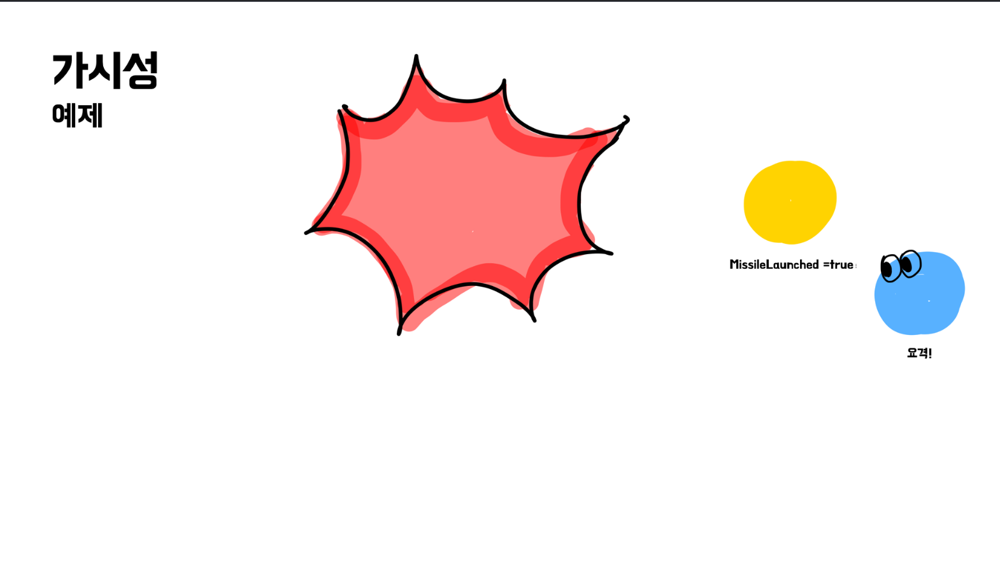
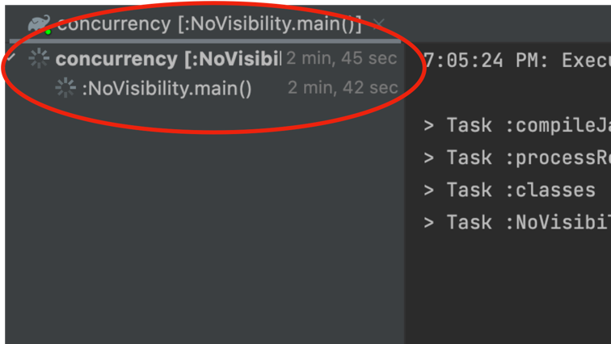
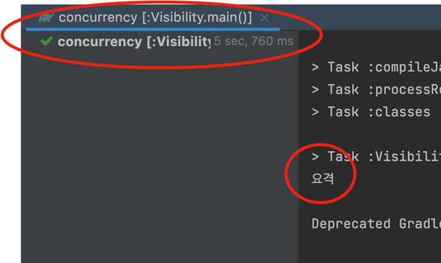

# 가시성 문제

## 예제 소개
가시성 문제를 설명하기 위해 간단한 예제를 보자.


미사일 요격 시스템을 만들건데, 스레드가 두 개가 있다.

한 스레드는 미사일이 날라오면 메모리에 `missileLaunched`변수의 값을 `true`로 변경한다.


다른 스레드는 `missileLaunched` 값을 뚫어져라 보고 있다가 `true`가 되면 요격 미사일을 날려서 격추시킨다.



자 이걸 코드로 옮겨보겠다.

```java
public class NoVisibility {
    public static boolean missileLaunched = false;

    private static class MissileInterceptor extends Thread {
        @Override
        public void run() {
            while (!missileLaunched) {/* 대기*/}
            System.out.println("요격");
        }
    }
    public static void main(String[] args) throws InterruptedException {
        final MissileInterceptor missileInterceptor = new MissileInterceptor();
        missileInterceptor.start();
        Thread.sleep(5000);
        launchMissile();
        missileInterceptor.join();
    }

    private static void launchMissile() {
        missileLaunched = true;
    }
}
```

먼저 `MissileInterceptor` 스레드를 보면 `missileLaunched`라는 공유변수를 반복문을 돌면서 true값이 될 때까지 보다가
true값이 확인되면 반복문을 벗어나고 `요격`이라는 문자열을 출력한다.

메인 메서드를 보면 `MissileInterceptor`를 시작하고 5초 후에 미사일을 발사시켜 `missileLaunched`를 true로 만든다.

결과를 보기 전에 결과를 한번 예상해보자. 
아마 시작하고 5초 뒤에 `missileLaunched`가 true가 되면서 `MissileInterceptor`가 반복문을 벗어나고 요격을 출력하길 기대할 것이다.

그럼 결과를 보자.


5초 뒤에 요격이 찍히긴 커녕 2분이 넘어가도록 `MissileInterceptor`는 아무 동작이 없다.
아직 반복문을 못 벗어난 것이다.

왜 이런 문제가 발생할까?

## 가시성

가시성이란 뭘까? 뭘 본다는 것일까? 바로 **메모리**를 말한다.

이해하기 위해 CPU 캐시 개념을 알아야 한다.

### CPU 캐시

자, 스레드는 CPU가 실행한다. CPU가 스레드를 실행할 때 필요한 변수는 어디에서 읽어오나? 바로 메모리에서 읽어온다.

근데 이 메모리와 CPU 사이의 거리가 너무 멀어서 CPU는 CPU 캐시라는 곳에 메모리의 값을 읽어와서 캐싱해둔다.

실행하던 스레드에서의 작업은 CPU 캐시의 값으로 진행을 하고 메모리에 작업한 결과를 덮어쓰는 방식으로 이루어진다.

### 예제 분석

자, 그럼 저 개념을 토대로 예제를 분석해보자.

1. `MissileInterceptor`를 실행하는 CPU에선 처음 메인 메모리에서 `missileLaunched`가 false라는 걸 읽어간다. (CPU 캐시에 false라고 저장됨)
2. 이후에 메인 스레드에서 `missileLaunched` 값을 true로 바꿔준다.
3. 그리고 `MissileInterceptor`에서 반복 돌면서 계속 `missileLaunched`를 읽는데 이땐 자기를 실행하는 CPU 캐시에서 값을 읽어들인다.
4. 결과적으로 중간에 변경된 값을 읽지 못하고 계속 CPU 캐시에 있는 false 값만 읽으면서 루프를 빠져나오지 못한다...

그럼 어떻게 해결해야 할까?

## volatile

자바에선 가시성 문제를 해결할 수 있는 `volatile`이라는 키워드를 제공한다.
이 키워드를 변수 선언부에 같이 사용하면 해당 변수는 CPU 캐시를 사용하지 않고 메인 메모리에 직접 읽고 쓰는 변수가 된다.

예제에 가시성 문제를 일으켰던 `missileLaunched`를 `volatile`변수로 선언하고 다시 실행시켜보자.

코드 변경
```java
public class Visibility {
    public volatile static boolean missileLaunched = false; // volatile 변수

    private static class MissileInterceptor extends Thread {
        @Override
        public void run() {
            while (!missileLaunched) {/* 대기*/}
            System.out.println("요격");
        }
    }
    public static void main(String[] args) throws InterruptedException {
        final MissileInterceptor missileInterceptor = new MissileInterceptor();
        missileInterceptor.start();
        Thread.sleep(5000);
        launchMissile();
        missileInterceptor.join();
    }

    private static void launchMissile() {
        missileLaunched = true;
    }
}
```

결과



처음 기대한 대로 5초 뒤에 요격이 잘 출력되는 걸 확인할 수 있다.
